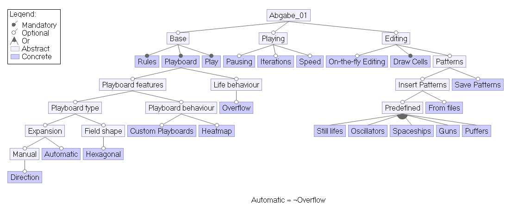

= SPL2018.Project.07

Basisprojekt aus Repository von Tino Steinort: https://github.com/tinosteinort/gameoflife

== READMEs
* link:GameOfLife-Task1/README.adoc[Task 1]
* link:GameOfLife-Task2/README.adoc[Task 2]
* link:GameOfLife-Task3/README.adoc[Task 3]
* link:GameOfLife-Task4/README.adoc[Task 4]
* link:GameOfLife-Task5/README.adoc[Task 5]

== Eclipse Import
* File > Import... > Gradle > Existing Gradle Project
    ** Alle Tasks werden damit importiert
* Build: `gradlew build` im Root-Ordner

== Model
